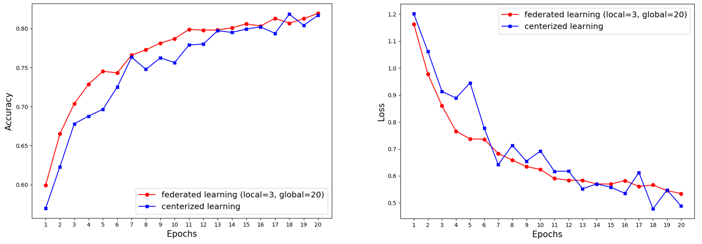
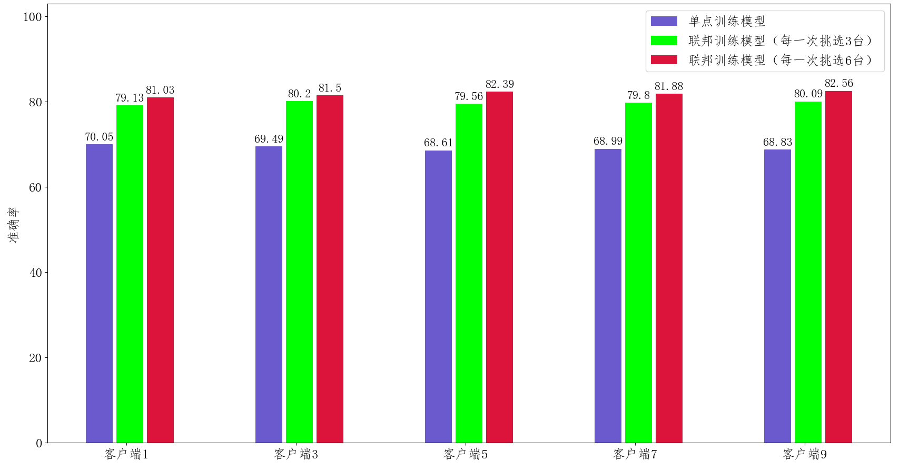

# 第3章：用Python从零实现横向联邦图像分类


本章是联邦学习实战书中第三章的配套代码。本章的代码运行需要首先安装[Python](https://www.anaconda.com/products/individual)、[Pytorch](https://pytorch.org/get-started/locally/)环境，并下载[cifar10](https://www.cs.toronto.edu/~kriz/cifar.html)数据集放置到data文件夹下面。


## 3.1 代码运行

在本目录下，在命令行中执行下面的命令：

```
python main.py -c ./utils/conf.json
```


## 3.2 服务端

横向联邦学习的服务端的主要功能是将被选择的客户端上传的本地模型进行模型聚合。但这里需要特别注意的是，事实上，对于一个功能完善的联邦学习框架，比如我们将在后面介绍的FATE平台，服务端的功能要复杂得多，比如服务端需要对各个客户端节点进行网络监控、对失败节点发出重连信号等。本章由于是在本地模拟的，不涉及网络通信细节和失败故障等处理，因此不讨论这些功能细节，仅涉及模型聚合功能。

下面我们首先定义一个服务端类Server，类中的主要函数包括以下几个。

- 定义构造函数。在构造函数中，服务端的工作包括：第一，将配置信息拷贝到服务端中；第二，按照配置中的模型信息获取模型，这里我们使用torchvision 的models模块内置的ResNet-18模型。

```python
class Server(object):
	def __init__(self, conf, eval_dataset):
	
		self.conf = conf 
		
		self.global_model = models.get_model(self.conf["model_name"]) 
		
		self.eval_loader = torch.utils.data.DataLoader(eval_dataset,     
                      batch_size=self.conf["batch_size"], shuffle=True)
```

- 定义模型聚合函数。前面我们提到服务端的主要功能是进行模型的聚合，因此定义构造函数后，我们需要在类中定义模型聚合函数，通过接收客户端上传的模型，使用聚合函数更新全局模型。聚合方案有很多种，本节我们采用经典的FedAvg 算法。

```python
def model_aggregate(self, weight_accumulator):
	for name, data in self.global_model.state_dict().items():
		update_per_layer = weight_accumulator[name] * self.conf["lambda"]
		if data.type() != update_per_layer.type():
			data.add_(update_per_layer.to(torch.int64))
		else:
			data.add_(update_per_layer)
```

- 定义模型评估函数。对当前的全局模型，利用评估数据评估当前的全局模型性能。通常情况下，服务端的评估函数主要对当前聚合后的全局模型进行分析，用于判断当前的模型训练是需要进行下一轮迭代、还是提前终止，或者模型是否出现发散退化的现象。根据不同的结果，服务端可以采取不同的措施策略。

```python
def model_eval(self):
	self.global_model.eval()
	total_loss = 0.0
	correct = 0
	dataset_size = 0
	for batch_id, batch in enumerate(self.eval_loader):
		data, target = batch 
		dataset_size += data.size()[0]
		if torch.cuda.is_available():
			data = data.cuda()
			target = target.cuda()
		
		output = self.global_model(data)
		total_loss += torch.nn.functional.cross_entropy(output, target,
										  reduction='sum').item() # sum up batch loss
		pred = output.data.max(1)[1]  # get the index of the max log-probability
		correct += pred.eq(target.data.view_as(pred)).cpu().sum().item()

	acc = 100.0 * (float(correct) / float(dataset_size))
	total_l = total_loss / dataset_size

	return acc, total_l
```


## 3.3 客户端

横向联邦学习的客户端主要功能是接收服务端的下发指令和全局模型，利用本地数据进行局部模型训练。与前一节一样，对于一个功能完善的联邦学习框架，客户端的功能同样相当复杂，比如需要考虑本地的资源（CPU、内存等）是否满足训练需要、当前的网络中断、当前的训练由于受到外界因素影响而中断等。读者如果对这些设计细节感兴趣，可以查看当前流行的联邦学习框架源代码和文档，比如FATE，获取更多的实现细节。本节我们仅考虑客户端本地的模型训练细节。我们首先定义客户端类Client，类中的主要函数包括以下两种。

- 定义构造函数。在客户端构造函数中，客户端的主要工作包括：首先，将配置信息拷贝到客户端中；然后，按照配置中的模型信息获取模型，通常由服务端将模型参数传递给客户端，客户端将该全局模型覆盖掉本地模型；最后，配置本地训练数据，在本案例中，我们通过torchvision 的datasets 模块获取cifar10 数据集后按客户端ID切分，不同的客户端拥有不同的子数据集，相互之间没有交集。

```python
class Client(object):
	def __init__(self, conf, model, train_dataset, id = -1):
		self.conf = conf
		self.local_model = models.get_model(self.conf["model_name"]) 
		self.client_id = id
		self.train_dataset = train_dataset
		all_range = list(range(len(self.train_dataset)))
		data_len = int(len(self.train_dataset) / self.conf['no_models'])
		train_indices = all_range[id * data_len: (id + 1) * data_len]

		self.train_loader = torch.utils.data.DataLoader(self.train_dataset, 
                                       batch_size=conf["batch_size"], 							 sampler=torch.utils.data.sampler.SubsetRandomSampler(train_indices))
```

- 定义模型本地训练函数。本例是一个图像分类的例子，因此，我们使用交叉熵作为本地模型的损失函数，利用梯度下降来求解并更新参数值，实现细节如下面代码块所示。
```python
def local_train(self, model):
	for name, param in model.state_dict().items():
		self.local_model.state_dict()[name].copy_(param.clone())
	optimizer = torch.optim.SGD(self.local_model.parameters(), lr=self.conf['lr'],
								momentum=self.conf['momentum'])
	self.local_model.train()
	for e in range(self.conf["local_epochs"]):
		for batch_id, batch in enumerate(self.train_loader):
			data, target = batch
			if torch.cuda.is_available():
				data = data.cuda()
				target = target.cuda()
			optimizer.zero_grad()
			output = self.local_model(data)
			loss = torch.nn.functional.cross_entropy(output, target)
			loss.backward()
			optimizer.step()
		print("Epoch %d done." % e)	
        
	diff = dict()
	for name, data in self.local_model.state_dict().items():
		diff[name] = (data - model.state_dict()[name])
	return diff
```


## 3.4 整合

当配置文件、服务端类和客户端类都定义完毕，我们将这些信息组合起来。首先，读取配置文件信息。
```python
with open(args.conf, 'r') as f:
	conf = json.load(f)	
```
接下来，我们将分别定义一个服务端对象和多个客户端对象，用来模拟横向联邦训练场景。
```python
train_datasets, eval_datasets = datasets.get_dataset("./data/", conf["type"])
server = Server(conf, eval_datasets)
clients = []

for c in range(conf["no_models"]):
	clients.append(Client(conf, server.global_model, train_datasets, c))
```
每一轮的迭代，服务端会从当前的客户端集合中随机挑选一部分参与本轮迭代训练，被选中的客户端调用本地训练接口local_train进行本地训练，最后服务端调用模型聚合函数model_aggregate来更新全局模型，代码如下所示。
```python
for e in range(conf["global_epochs"]):
	candidates = random.sample(clients, conf["k"])
	weight_accumulator = {}
	for name, params in server.global_model.state_dict().items():
		weight_accumulator[name] = torch.zeros_like(params)
	for c in candidates:
		diff = c.local_train(server.global_model)
		for name, params in server.global_model.state_dict().items():
			weight_accumulator[name].add_(diff[name])
	server.model_aggregate(weight_accumulator)
	acc, loss = server.model_eval()
	print("Epoch %d, acc: %f, loss: %f\n" % (e, acc, loss))
```


## 3.5 配置信息

本案例的配置信息在：[conf.json](./utils/conf.json)，读者可以根据实际需要修改。

* model_name：模型名称
* no_models：客户端数量
* type：数据集信息
* global_epochs：全局迭代次数，即服务端与客户端的通信迭代次数
* local_epochs：本地模型训练迭代次数
* k：每一轮迭代时，服务端会从所有客户端中挑选k个客户端参与训练。
* batch_size：本地训练每一轮的样本数
* lr，momentum，lambda：本地训练的超参数设置


## 3.6 联邦学习与中心化训练的效果对比

<div align=center>

</div>


- 联邦训练配置：一共10台客户端设备（no\_models=10），每一轮任意挑选其中的5台参与训练（k=5）， 每一次本地训练迭代次数为3次（local\_epochs=3），全局迭代次数为20次（global\_epochs=20）。

- 集中式训练配置：我们不需要单独编写集中式训练代码，只需要修改联邦学习配置既可使其等价于集中式训练。具体来说，我们将客户端设备no\_models和每一轮挑选的参与训练设备数k都设为1即可。这样只有1台设备参与的联邦训练等价于集中式训练。其余参数配置信息与联邦学习训练一致。图中我们将局部迭代次数分别设置了1，2，3来进行比较。


## 3.7 联邦学习在模型推断上的效果对比

<div align=center>

</div>

图中的单点训练只的是在某一个客户端下，利用本地的数据进行模型训练的结果。

- 我们看到单点训练的模型效果（蓝色条）明显要低于联邦训练 的效果（绿色条和红色条），这也说明了仅仅通过单个客户端的数据，不能够 很好的学习到数据的全局分布特性，模型的泛化能力较差。
- 此外，对于每一轮 参与联邦训练的客户端数目（k 值）不同，其性能也会有一定的差别，k 值越大，每一轮参与训练的客户端数目越多，其性能也会越好，但每一轮的完成时间也会相对较长。