# 第6章：用FATE从零实现纵向线性回归

本章我们学习利用FATE从零开始构建一个简单的纵向线性回归模型，经过本章的学习，读者应该能够了解利用FATE进行横向建模的基本流程，与第五章一样，考虑到本书的篇幅和写作目的，我们本章不对FATE的底层原理进行过多的分析讲解。

**注：与第五章一样，由于FATE平台在不断迭代和更新的过程中，本章的内容撰写截稿时间较早（2020年9月截稿），可能会因版本变化而导致配置方式和运行方式发生改变，因此，强烈建议读者如果想深入了解FATE的最新使用、已经最新版本信息，可以直接参考FATE官方文档教程：**

* [FATE的安装部署](https://github.com/FederatedAI/DOC-CHN/tree/master/%E9%83%A8%E7%BD%B2)
* [FATE的官方文档](https://github.com/FederatedAI/DOC-CHN)

**如果FATE的安装和使用遇到任何问题，可以添加FATE小助手，有专门的工程团队人员帮忙解决。**

<div align=center>

</div>

## 6.1 实验准备

与第五章一样，在学习本章之前，请读者确保已经安装[Python](https://www.anaconda.com/products/individual)和[FATE单机版](https://github.com/FederatedAI/DOC-CHN/blob/master/%E9%83%A8%E7%BD%B2/FATE%E5%8D%95%E6%9C%BA%E9%83%A8%E7%BD%B2%E6%8C%87%E5%8D%97.rst)。

**注意：本书编写时，FATE主要支持的是使用dsl和conf配置文件来构建联邦学习模型，而在之后的最新版本中，FATE也进行了很多方面的改进，特别是最新引入了pipeline的建模方式，更加方便，有关FATE pipeline的训练流程，读者可以参考文档：[FATE-Pipeline](https://github.com/FederatedAI/FATE/tree/master/examples/pipeline)。**


## 6.2 数据集获取

本章我们使用波士顿房价预测数据集（Boston Housing）作为本章的实验数据集，数据集可以从直接使用sklearn库的内置数据集获取：

```
from sklearn.datasets import load_boston
import pandas as pd 


boston_dataset = load_boston()

boston = pd.DataFrame(boston_dataset.data, columns=boston_dataset.feature_names)

boston['y'] = boston_dataset.target

boston.head()
```


## 6.3 数据集切分

为了能够有效的模拟纵向联邦的案例，我们首先在本地将Boston Housing数据集切分为纵向联邦的形式，假设当前我们有两方参与纵向联邦训练，我们首先从Boston Housing数据集中抽取前406条作为训练数据，后面100条作为评估测试数据。

* 训练数据集切分：从406条训练数据中随机抽取360条数据和前8个特征作为公司A的本地数据，文件保存为housing_1_train.csv。同样再从这406条训练数据中抽取380条数据和后5个特征，以及标签MEDV作为公司B的本地数据，文件保存为housing_2_train.csv，这两份数据分别发送到公司A和公司B。

  训练数据集切分代码请查看：[split_training_dataset.py](split_training_dataset.py)

* 测试数据集切分：从100条评估测试数据中随机抽取80条数据和前8个特征作为公司A的本地测试数据，文件保存为housing_1_eval.csv。再从这100条测试数据集中随机抽取85条数据和后5个特征，以及标签MEDV作为公司B的本地测试数据，文件保存为housing_2_eval.csv。同样将这两份数据分别发送给公司A和公司B。

  测试数据集切分代码请查看：[split_eval_dataset.py](split_eval_dataset.py)

切分后的数据分布如下所示：

<div align=center>
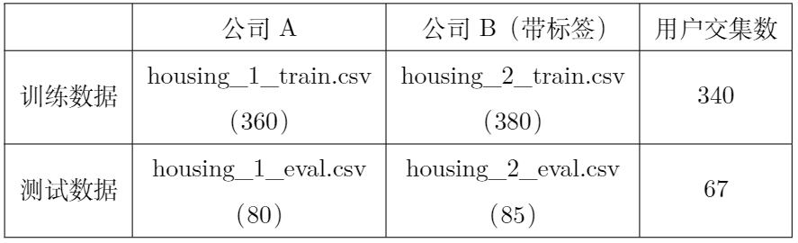
</div>


## 6.4 利用FATE构建纵向联邦学习Pipeline

用FATE构建纵向联邦学习Pipeline，涉及到四个方面的工作：

* 数据转换输入
* 加密样本对齐
* 模型训练
* 模型评估：（可选）

从上面可以看出，与横向联邦相比，纵向联邦学习多了加密样本对齐这一步骤，为了方便后面的叙述统一，我们同样假设读者安装的FATE单机版本目录为：

```
fate_dir=/data/projects/fate-1.3.0-experiment/standalone-fate-master-1.4.0/
```


### 6.4.1 数据转换输入

该步骤是将6.2中切分的本地数据集文件转换为FATE的文件格式DTable，DTable是一个分布式的数据集合：

<div align=center>
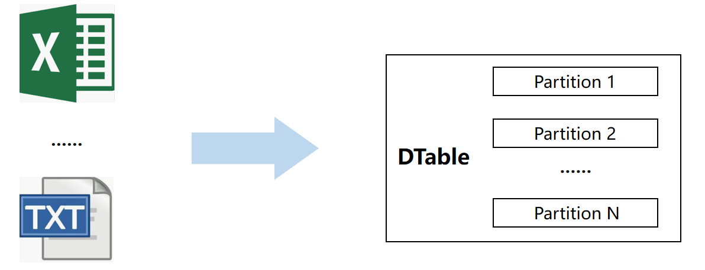
</div>


如书中所述，将数据格式转换为DTable，需要执行下面几个步骤即可：

* 将本地的切分数据上传到$fate_dir/examples/data目录下
* 进入$fate_dir/examples/federatedml-1.x-examples目录，打开upload_data.json文件进行更新, 以housing_1_train.csv文件为例：

```
{
  "file": "examples/data/housing_1_train.csv",
  "head": 1,
  "partition": 10,
  "work_mode": 0,
  "table_name": "homo_breast_1_train",
  "namespace": "homo_host_breast_train"
}
```

最后在当前目录下（$fate_dir/examples/federatedml-1.x-examples），在命令行中执行下面的命令，即可自动完成上传和格式转换：

```
python $fate_dir/fate_flow/fate_flow_client.py -f upload -c upload_data.json
```


对于其它文件，可以按照上面的方法自行转换


### 6.4.2 加密样本对齐

本节我们介绍在FATE中实现的一种基于RSA加密和哈希函数相结合求解加密样本ID匹配方案，两方场景下的PSI示例如下图所示：

<div align=center>
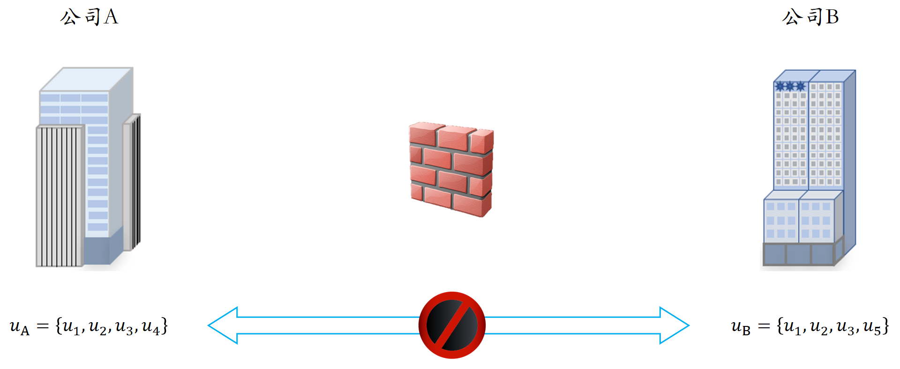
</div>


不失一般性，我们设公司$A$方的用户集合为$u_A=(u_1, u_2, u_3, u_4)$，公司$B$方的用户集合为$u_B=(u_1; u_2; u_3; u_5)$。

- **步骤一**：公司$B$方利用RSA算法生成公钥对$(n; e)$和私钥对$(n; d)$，并将公钥对$(n; e)$发送给公司$A$。

  <div align=center>
  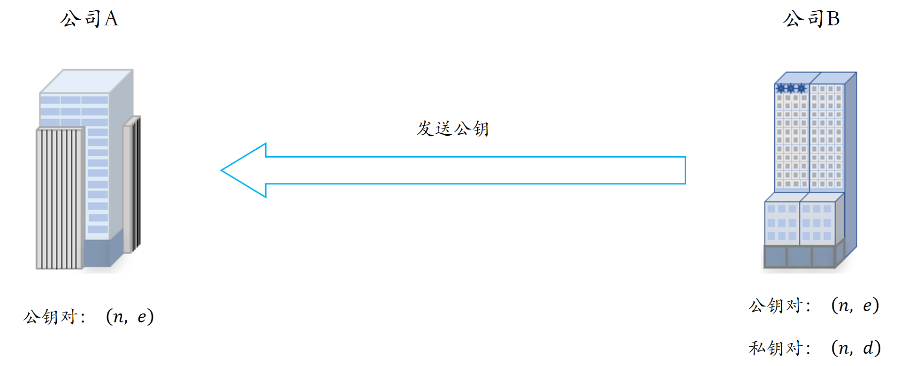
  </div>

&nbsp;


- **步骤二**：公司A对其本地的用户集合$u_A$中的每一个元素$u_i$，生成一个对应的随机数$r_i$，利用公钥对$(n,e)$对随机数$r_i$进行加密得到$r_i^e\%n$；并将$u_i$代入哈希函数$H$中得到$H(u_i)$。将两者相乘，得到：

  <div align=center>
  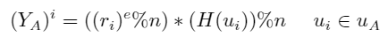
  </div>

  设$Y_A=[(Y_A)^i]_{i=1}^{4}$，我们注意到$u_i$、$r_i$与$(Y_A)^i$三者之间是一一对应的。将$Y_A$发送给公司$B$方。同时我们在公司$A$中保存$Y_A$与$u_A$值的一一对应关系映射表，记为$(Y_A \rightarrow u_A)$。


<div align=center>
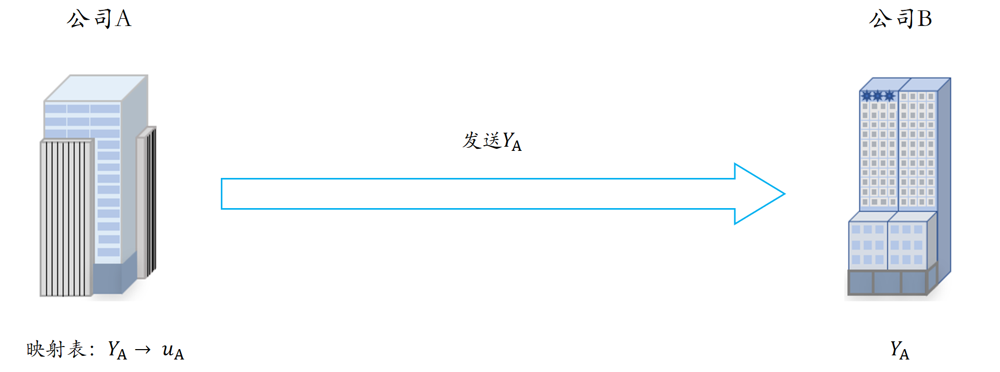
</div>
&nbsp;

- **步骤三**：公司B方利用私钥对$(n,d)$，对$Y_A$进行解密，记为$Z_A$，得到：

  <div align=center>
  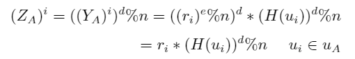
  </div>

  同时公司$B$方利用哈希函数$H$作用于本地用户集合$u_B$中的每一个元素，得到$H(u_B)$，再利用私钥对$(n; d)$对$H(u_B)$加密，重新输入到哈希函数$H$中，得到$Z_B$：

  <div align=center>
  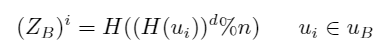
  </div>

  将$Z_A=[{(Z_A)^i}]\_{i=1}^4$，$Z_B=[{(Z_B)^i}]\_{i=1}^4$和映射$(Y_A \rightarrow Z_A)$一起发送给公司$A$。

  <div align=center>
  
  </div>
&nbsp;


- **步骤四**：公司$A$方首先映射表$(Y_A \rightarrow u_A)$与映射表$(Y_A \rightarrow Z_A)$进行join运算得到新的映射表$(Z_A \rightarrow u_A)$。同时，将$(Z_A)^i$值除于随机数$r_i$，并代入哈希函数$H$中，得到：

  <div align=center>
  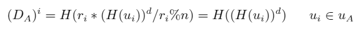
  </div>

  将$(Z_A\ \to \ D_A)$与映射表$(Z_A\ \to \ u_A)$进行join运算得到新的映射表$(D_A\ \to \ u_A)$。

  &nbsp;

- **步骤五**：将$D_A$与$D_B$执行相交运算，得到加密和哈希组合状态下的ID交集，记为$I$：

  <div align=center>
  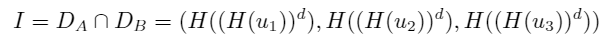
  </div>

  集合$I$中的元素是映射表$(D_A \to u_A)$中的key值，因此我们利用该映射表，查找出对应的明文集合，设$I$对应的明文状态下的集合为$(u_1,u_2,u_3)$，这样公司A方得到了交集结果。但我们不能直接发送明文结果给公司B方（防止信息泄露），而是将集合$I$发送给公司B，B方利用自身的映射表单独求取明文结果。

  <div align=center>
  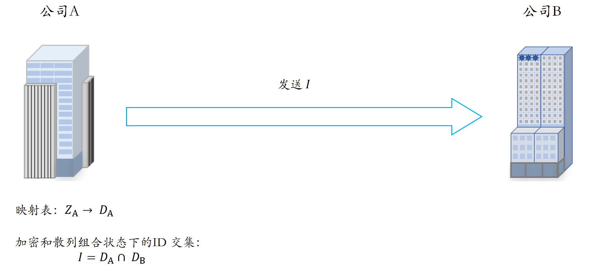
  </div>

  &nbsp;

- **步骤六**：同理，集合$I$中的元素同样是公司B方本地映射表$(D_B\ \to \ u_B)$的key值，利用该映射表，我们同样能够查询出$I$对应的明文状态下的交集$(u_1,u_2,u_3)$。至此，公司A和公司B完成了在加密状态下，求取相交的用户集合。

  &nbsp;

### 6.4.3 模型训练

与横向联邦一样，利用FATE构建纵向联邦同样是通过在dsl和conf文件中进行配置，本文件夹中，已经为读者准备了两个不同的配置：

下面是最基本的纵向联邦建模配置：

* [test_hetero_linr_train_job_dsl.json](https://github.com/FederatedAI/Practicing-Federated-Learning/blob/main/chapter06_FATE_VFL/test_hetero_linr_train_job_dsl.json)
* [test_hetero_linr_train_job_conf.json](https://github.com/FederatedAI/Practicing-Federated-Learning/blob/main/chapter06_FATE_VFL/test_hetero_linr_train_job_conf.json)

如果想单独设置额外的评估数据，我们需要创建单独的评估数据模块：

* [test_hetero_linr_train_eval_job_dsl.json](https://github.com/FederatedAI/Practicing-Federated-Learning/blob/main/chapter06_FATE_VFL/test_hetero_linr_train_eval_job_dsl.json)
* [test_hetero_linr_train_eval_job_conf.json](https://github.com/FederatedAI/Practicing-Federated-Learning/blob/main/chapter06_FATE_VFL/test_hetero_linr_train_eval_job_conf.json)


将dsl和conf文件放置在任意目录下，并在该目录下执行下面的命令进行训练：

```
python $fate_dir/fate_flow/fate_flow_client.py -f submit_job -d ***_dsl.json -c ***_conf.json
```

