# 第9章：联邦个性化推荐

个性化推荐已经被广泛应用到人们生活中的各个方面，例如新闻推荐、视频推荐、商品推荐等，在信息筛选、精准营销等方面起到至关重要的作用。为了实现精准的推荐效果，推荐系统会收集海量用户和所推荐内容的数据，一般而言，收集的数据越多，对用户和推荐内容的了解就越全面和深入，推荐效果越精准。常见的个性化推荐应用包括音乐推荐、电影推荐、短视频、feed流等，如下图所示。

&nbsp;

传统的个性化推荐流程如下图所示，即系统首先将每一个用户的行为流水数据上传到中心数据库中，在中心端进行集中式的数据清理和模型训练，再将训练后的模型部署到线上。

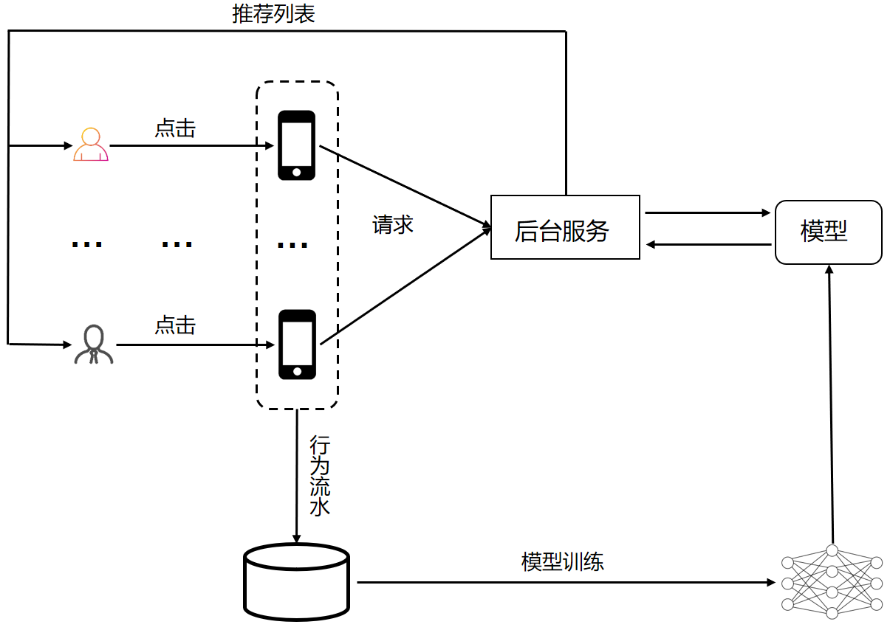

但上述的集中式处理方式，由于需要将每一个用户的行为数据上传到服务端中，因此极容易造成隐私的泄露。联邦推荐，实现了在不需要用户行为数据离开本地的前提下，进行联合建模的目的。本章我们将介绍两种联邦推荐算法在FATE的实现，包括：

- 联邦矩阵分解
- 联邦因子分解机

  

## 9.1 联邦矩阵分解

### 9.1.1 代码实现

联邦矩阵分解的代码已经集成到FATE中，读者可以查看联邦矩阵分解的代码：[Matrix_Factorization](https://github.com/FederatedAI/FedRec/tree/master/federatedrec/matrix_factorization)

### 9.1.2 矩阵分解

一般而言，用户与物品之间的交互方式多种多样，如评分、点击、购买、收藏、删除等，这些行为都体现了用户对物品的喜好，我们将用户对物品的反馈用一个矩阵r来表示，这个矩阵也被称为评分矩阵(Rating Matrix)。

矩阵分解算法是指将原始评分矩阵$r$分解为两个小矩阵$p$和$q$，使其满足：

$$r=p \times q$$

不失一般性，我们假设矩阵$r$的维度大小为$m\*n$，$p$的维度大小为$m\*k$，$q$的维度大小为$k\*n$，$k$表示隐向量的长度，它通常是一个值比较小的数，如$k=50$或者$k=100$，这里$m$表示的是用户的数量，$n$表示的是物品的数量，通过矩阵分解，我们将评分矩阵压缩为两个小矩阵$p$和$q$，分别称之为用户隐向量矩阵和物品隐向量矩阵。

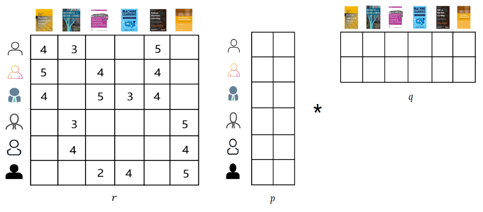

MF的优化目标函数如下：

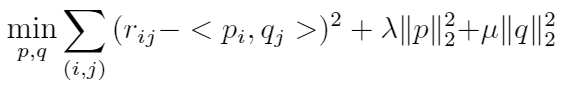

### 9.1.3 矩阵分解的联邦实现

我们考虑如下场景的跨公司推荐问题。在该场景下，我们看到左边的公司A是以书籍为内容进行推荐，而右边的公司B是以电影为内容进行推荐。**两家公司的用户具有较高的重合度**。

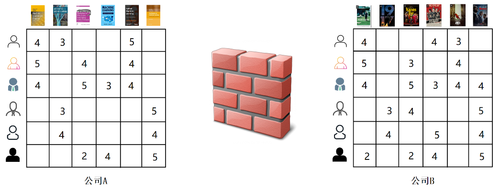

根据协同过滤的思想，具有相同观影兴趣的用户很可能有相同的阅读兴趣，因此如果我们能够保证在不泄露用户数据隐私前提下，联合多方的数据进行建模，那么将对推荐效果的提升有明显的促进作用。

我们采用**纵向联邦学习**的思想，由于两间公司它们的产品不同，从纵向联邦的角度来说，也就是它们的特征不重叠(一方的特征是书的ID，另一方的特征是电影ID)。每一间公司分别有用户对物品的评分矩阵，但由于隐私保护的原因，公司之间不能共享这些评分数据。为此，我们首先将目标函数拆分为如下的形式：

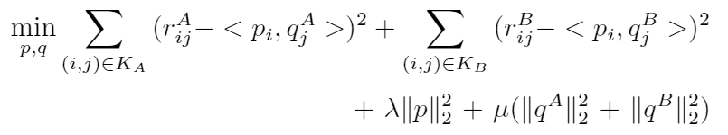

其中$r^A\_{ij}$和$r^B_{ij}$分别代表了公司A和公司B的原始评分矩阵，由于两间公司的用户群体相同，也就是说，它们共享用户的隐向量信息$p$，我们首先引入一个可信的第三方server来维护共享的用户隐特征向量信息，即我们的矩阵$p$，这个矩阵$p$是通过随机初始化的方式在server端生成。

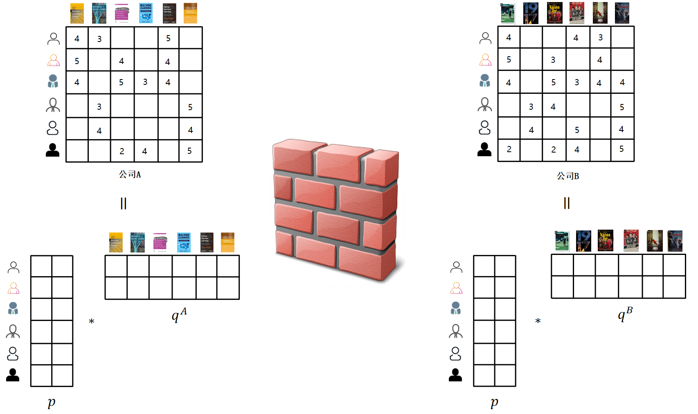

求解联邦矩阵分解的步骤如下所示：

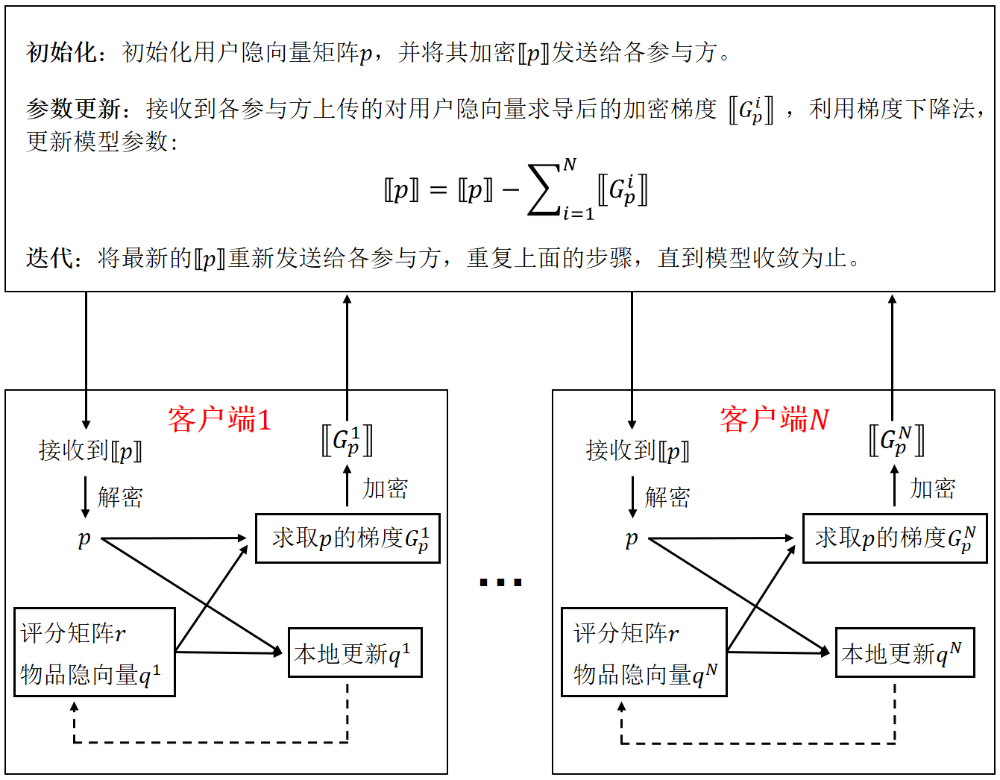

&nbsp;

## 9.2 联邦因子分解机

### 9.2.1 代码实现

联邦因子分解机的代码已经集成到FATE中，读者可以查看联邦因子分解机的代码：[Factorization_Machine](https://github.com/FederatedAI/FedRec/tree/master/federatedrec/factorization_machine)

### 9.2.2 因子分解机

因子分解机（FM）将推荐问题归结为回归问题。传统的线性模型，如线性回归等，因其模型简单，可以高效的学习、预测和部署，因此在工业界备受推崇，但线性模型只能捕获到线性信息，不能捕获非线性信息，也就是特征与特征之间的相互作用。这种特征与特征之间的相互作用，就是特征工程中常用的交叉特征（也称为组合特征）。

人为构造交叉特征非常耗时，而且更多的是依赖于经验或者试错。FM算法通过在线性模型中加入了二阶信息，为我们自动构建和寻找交叉特征提供了一种可行的方案，FM模型如下所示，

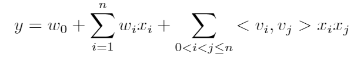

其中最后的项${x_i}{x_j}$，就是指任意两个特征$x_i$和$x_j$的交叉特征。

### 9.2.3 因子分解机的联邦实现

我们考虑如下场景的跨公司推荐问题。在该场景中，公司A是一间在线的书籍销售商，而公司B可以是一间社交网络公司，公司B不直接销售商品，但是它有每个用户的画像数据。**同样，我们假设两家公司的用户具有较高的重合度**。

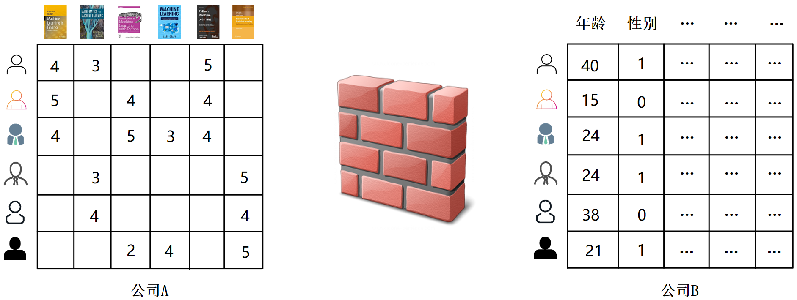

如果公司A能够利用公司B的画像数据，对公司A的销售同样有很好的提升，试想一下，如果我们知道某个用户是25岁，职业是程序员，那么一般情况下，给他推荐IT书籍的概率要比推荐漫画的概率高。

我们采用**纵向联邦学习**的思想，为了后面讨论的方便，我们将问题描述如下：假设现在A公司有用户的反馈分数和部分特征信息，我们设为$(X_1, Y)$，而公司B拥有额外的特征数据，设为$X_2$，我们需要保证在两方的数据不出本地的前提下，帮助A方提升推荐性能。对于两方的联合建模，其FM模型可以表示为：

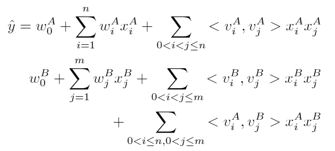

上面的模型设计，我们可以将其拆分为由下面的三个部分构成，这三部分分别是：

- 第一部分表示只考虑公司A特征的预测值，满足：

  

  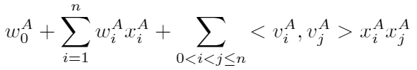
  

- 第二部分表示只考虑公司B特征的预测值，满足：

  

  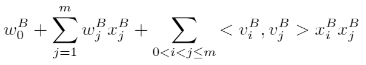
  

- 第三部分表示分布在两家公司的交叉特征计算，满足：

  

  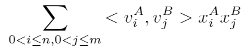
  

求解联邦因子分解机的步骤如下所示：

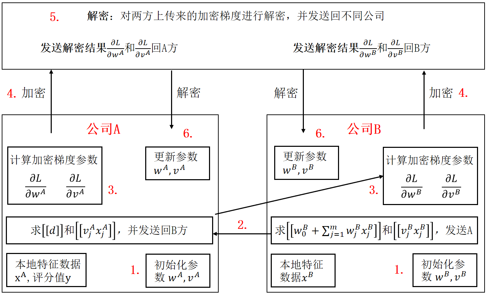

## 9.3 其它联邦推荐算法

除了矩阵分解和因子分解机，在FATE中还已经实现了很多的[联邦推荐](https://github.com/FederatedAI/FedRec/tree/master/federatedrec)算法，读者可以点击该链接查找相应的算法实现：

- ##### [Hetero FM(factorization machine)](https://github.com/FederatedAI/FedRec/blob/master/federatedrec/factorization_machine/README.md)

- ##### [Homo-FM](https://github.com/FederatedAI/FedRec/blob/master/federatedrec/factorization_machine/README.md)

- ##### [Hetero MF(matrix factorization)](https://github.com/FederatedAI/FedRec/blob/master/federatedrec/matrix_factorization/README.md)

- ##### [Hetero SVD](https://github.com/FederatedAI/FedRec/blob/master/federatedrec/svd/README.md)

- ##### [Hetero SVD++](https://github.com/FederatedAI/FedRec/blob/master/federatedrec/svdpp/README.md)

- ##### [Hetero GMF](https://github.com/FederatedAI/FedRec/blob/master/federatedrec/general_mf/README.md)

