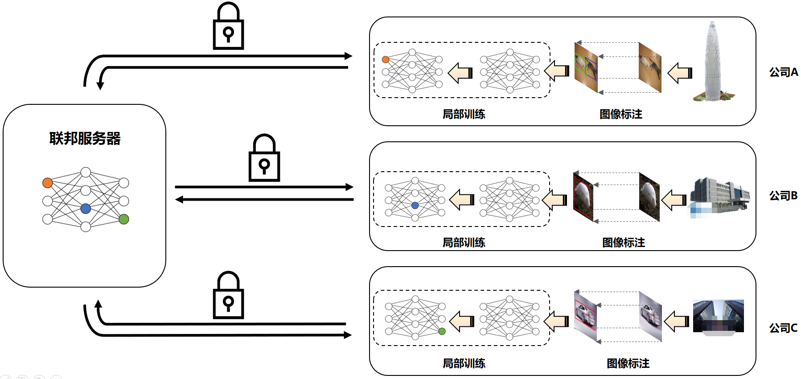
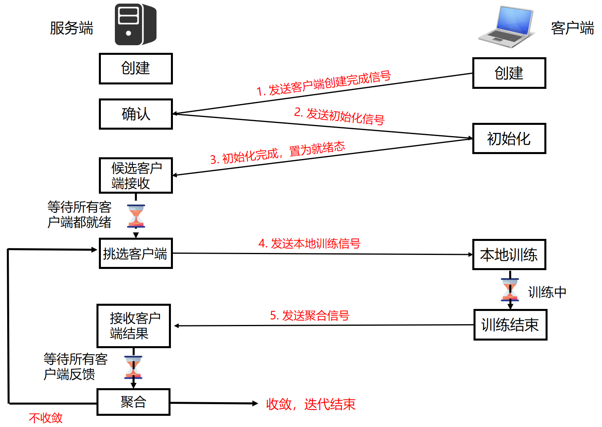
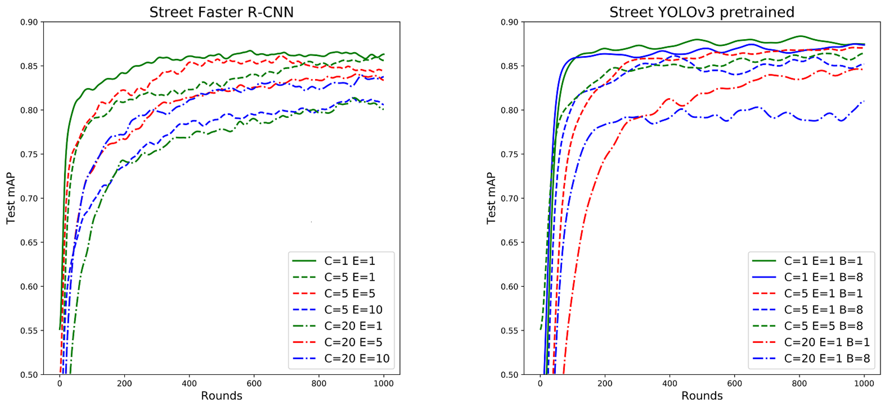
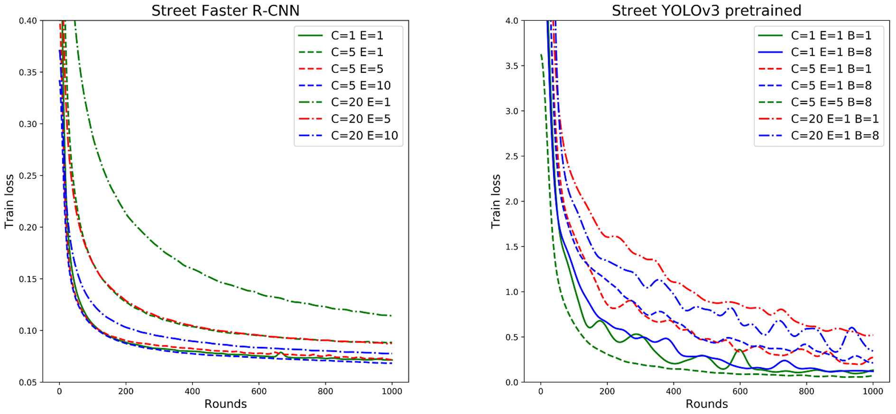

# 第10章：联邦视觉案例

本章是《联邦学习实战》的第十章，我们将介绍在联邦学习场景下，利用分散在各摄像头的数据，构建一个联邦视觉系统，如下图所示：

<div align=center>

</div>

有关联邦视觉相关的一些文献，读者可以参考下面的链接：

* [FedVision: An Online Visual Object Detection Platform Powered by Federated Learning](https://arxiv.org/abs/2001.06202)

* [Real-World Image Datasets for Federated Learning](https://arxiv.org/abs/1910.11089)

目前联邦视觉系统已经有下面的两种实现方式：

- 采用**flask_socketio**来作为服务端和客户端的通信方式实现。
- 基于**PaddleFL**的实现，详细的实现过程，读者可以参考[FedVision_PaddleFL](https://github.com/FederatedAI/FedVision)。

本章我们我们**flask_socketio**来作为服务端和客户端的通信方式，服务端与客户端的通信过程如下所示：


<div align=center>

</div>


## 10.1 数据集准备


    

- **使用外部的公开数据集**直接使用外部常见的目标检测数据集，来自行运行代码（可能由于数据集的不同，需要自行修改深度学习模型）。常见的目标检测数据集包括：

  * [PASCAL VOC](http://host.robots.ox.ac.uk/pascal/VOC/)
  * [MS COCO](https://cocodataset.org/#download)

  获取数据集后，将其放在data目录下，读者可根据实际需要自行切分数据集。

  

## 10.2 实验环境

要执行的本章的代码，首先需要读者准备好以下的环境：

* 安装带GPU版本的PyTorch，本章的代码只能在GPU环境下运行。
* 安装flask_socketio，本章我们使用flask_socketio来作为服务端和客户端之间进行通信的框架。
* 其他的安装环境，可以查看requirements.txt文件，并执行下面代码进行安装：
	```
	pip install -r requirements.txt
	```


## 10.3 代码使用

当下载了数据集和安装了必要的运行环境后，我们便可以按照下面的步骤来执行代码：
* 首先执行下面的命令来启动服务端：
  
    ```bash
    sh ./run_server.sh dataset model port
    ```
	这里包含三个输入参数：
	
	1. dataset: 数据集名称，可选项包括“street_5“、”street_20”。
	
	2. model：模型参数，可选项包括”faster“、”yolo“。
	
	3. port：端口号，由用户自行设置。
	
	
	
* 然后执行下面命令来启动客户端：
    ```bash
    sh ./run.sh dataset gpu_id model port
    ```
	客户端的启动包含了四个输入参数：
	
	1. dataset: 数据集名称，与服务端一样，可选项包括“street_5“、”street_20”。
	
	2. gpu_id：如果是在本地环境中模拟多个客户端场景，由于每一个客户端进行本地训练都需要单独的GPU资源，因此，为了防止客户端都绑定在同一个GPU核中执行，导致显存不足程序中断。我们可以将每一个客户端指定到不同的GPU核中执行；如果是分布式环境下执行，即每一个客户端在单独的设备中运行，那么这个参数随意设置即可。
	
	3. model：模型参数，与服务端一样，可选项包括”faster“、”yolo“。
	
	4. port：端口号，由用户自行设置。
	
	   

在运行过程中，如果要强行终止，我们也可以执行下面的命令来强制终止代码的运行：
    ```bash
    sh ./stop.sh street_5 yolo
    ```


## 10.4 实验效果
我们分别使用YOLOv3和Faster R-CNN两个模型，在联邦学习场景下，测试对街道数据集进行联合建模的结果比较。

我们分别测试了在不同数量的客户参与方（C），以及不同的本地训练迭代次数（E）配置下，其中mAP的结果如下图所示：

<div align=center>

</div>

其损失值随迭代次数的变化的变化结果如下所示：

<div align=center>

</div>
