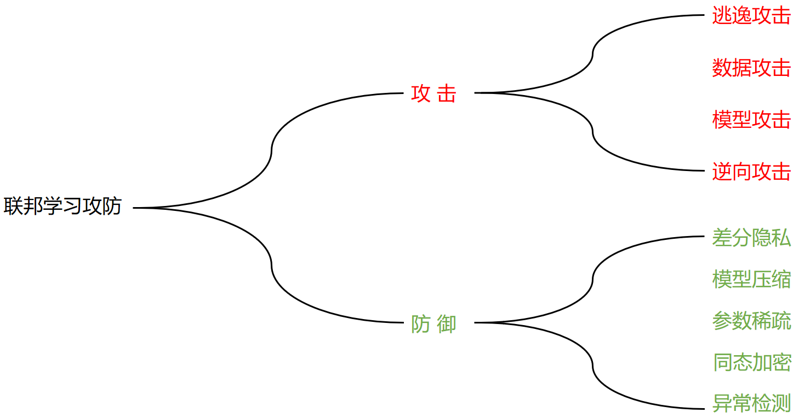

# 第15章：联邦学习攻防实战

联邦学习因其设备间的独立性、数据间的异构性、数据分布的不平衡和安全隐私设计等特点，使得联邦学习更容易受到对抗攻击的影响，本章我们将从攻击和防御两个角度，讲述当前联邦学习训练过程中常见的攻防策略。

下图我们概述了常见的一些攻击与防御类型，与传统机器学习不同，联邦学习的攻击和防御可以分为在服务端侧和客户端侧两种。

下面我们首先从攻击的角度来，来分析联邦学习场景下常见的攻击模式：
- 逃逸攻击（Evasion Attack）：是指在攻击者在不改变机器学习模型的前提下，通过对输入样本进行修改，来达到欺骗模型的目的。逃逸攻击主要发生在模型推断阶段，不管是在联邦学习的场景中，还是在传统的中心化训练场景中，逃逸攻击都是一种常见的攻击模式。

- 数据攻击（Data Poisoning Attack）：也称为数据下毒。机器学习的模型都是基于历史样本数据进行训练得到，因此攻击者可以通过对训练数据进行篡改，让训练得到的模型按照攻击者的意图进行输出。

  数据攻击是联邦学习场景中非常常见的一种攻击模式，由于参与联邦训练的每一个设备端之间是相互独立的，因此，当一个客户端被挟持后，攻击者可以完全控制该客户端，包括对其本地数据进行篡改，从而达到污染整个全局模型的目的，后门攻击就是一种典型的数据攻击方案。

- 模型攻击（Model Attack）：模型攻击是指攻击者在模型训练的过程中， 通过修改模型的参数来达到破坏模型的目的。

  在传统的中心化训练中，模型的训练过程，是先由用户先输入数据，经梯度下降等最优化方法进行迭代训练而得到，因此，中间的训练过程通常用户没有办法参与，很难在训练的过程中篡改模型。但在联邦学习的场景下则不同，联邦学习的训练过程，模型会在客户端和服务端之间进行多次交互传输，与数据攻击一样，当攻击者挟持了一个客户端后，那么攻击者同样可以对获取的全局模型进行修改，并将修改后的模型上传到服务端，从而达到攻击的目的。
  

- 模型逆向攻击：是指攻击通过对模型执行特定的逆向工程，来获取模型的参数或者训练的原始数据，包括模型萃取攻击（Model Extraction Attacks）、成员推理攻击（Membership Inference Attacks）、模型逆向攻击（Model Inversion Attack）。

针对对联邦学习存在的攻击威胁，联邦学习的防御方案已经成为当前的研究热点。第二章我们已经对联邦学习的安全机制进行了理论上的探讨，主要包括：

- 同态加密：从计算的角度来看，由于同态加密的性质，使得数据在加密状态下的计算结果与明文状态下的计算结果一致。从安全性的角度来看，由于数据加密，即使模型被窃取，攻击者也无法知道模型的真实参数，能够有效阻止对模型的攻击。考虑到安全性与效率的平衡，在实际的应用过程中，常常采用的是半同态加密算法。
- 差分隐私：差分隐私是一种非常常用的安全计算方案，与同态加密不同，差分隐私通过添加噪音的方式来达到保护模型参数和数据隐私安全的目的。
- 模型压缩：模型压缩能够让模型变得更加轻型，方便部署和传输。此外，模型经过压缩后，使得用户只获得模型的部分参数信息，防止原始模型的泄露。
- 参数稀疏：参数稀疏化也是模型压缩的一种实现，通过结合掩码矩阵，只传输部分的参数，这样即使模型被窃取，攻击者也很难还原出原始的模型，从而达到保护原始模型的目的。
- 异常检测：针对数据下毒和模型的篡改，目前比较有效的方案是通过异常检测的方法，来检测出异常的客户端模型，此外，联邦学习的selection机制，也能够在一定程度上防止恶意模型的连续性攻击。

鉴于本书的篇幅限制，本章我们将讲解下面几种攻击方法和防御方案，包括：

- [后门攻击](../chapter15_Backdoor_Attack)
- [差分隐私](../chapter15_Differential_Privacy)
- [模型压缩](../chapter15_Compression)
- [稀疏化](../chapter15_Sparsity)
- [同态加密](../chapter15_Homomorphic_Encryption)

