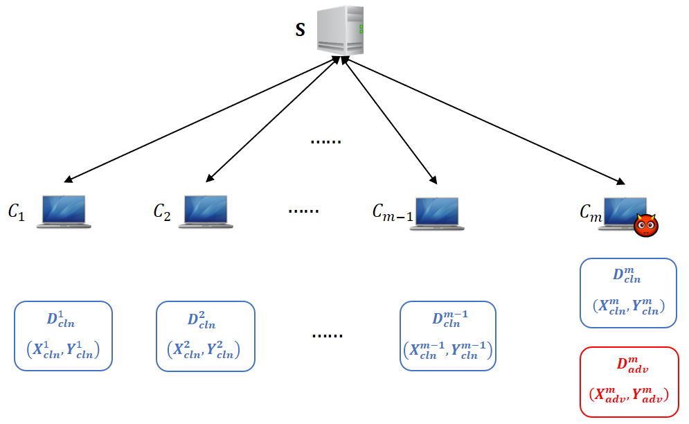
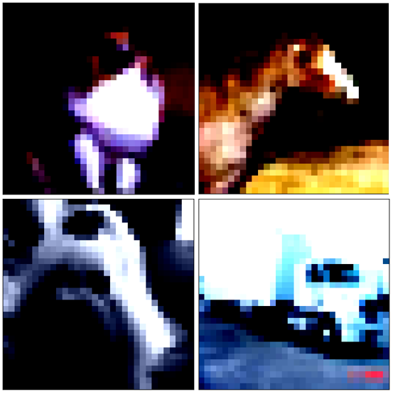
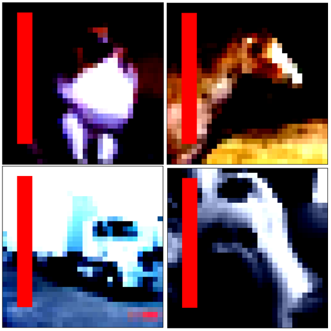

# 15.1：后门攻击

后门攻击是联邦学习中比较常见的一种攻击方式，攻击者意图让模型对具有某种特定特征的数据做出错误的判断，但模型不会对主任务产生影响，本节我们将讨论一种在横向联邦场景下的后门攻击行为。


## 15.1.1 代码使用

在本目录下，在命令行中执行下面的命令：

```
python main.py -c ./utils/conf.json
```


## 15.1.2 后门攻击图例

本节我们将讨论一种在横向联邦场景下的后门攻击行为，如下图所示：

<div align=center>

</div>
我们看到在图中，一共有$m$个客户端，分别记为$\{C_i\}_{i=1}^{m}$，其中$C_m$是恶意客户端，其余为正常客户端。

&nbsp;

对于正常客户端$C_i (i=1,...,{m-1})$，它们本地的数据集分别记为$D^i_{\rm cln} (i=1,...,{m-1})$；对于恶意客户端$C_m$，除了包含正常数据集$D^m_{\rm cln}$外，还包括毒化数据集$D^m_{\rm adv}$。


## 15.1.3 恶意数据集样例

这里我们介绍两种带有后门的毒化训练数据集：

- 第一种方式：我们不需要人为手动修改图片数据，图片具有明显的某种特征，如下图所示，所有的图片都是红色的小车，红色和小车就是其特有的特征。我们期望将所有具有红色特征的小车都识别为小鸟。

  <table border=0>
  	<tbody>
  		<tr>
  			<td width="30%" align="center"> 原始数据集 </td>
  			<td width="30%" align="center"> 毒化数据集 </td>
  			<td width="20%" align="center"> 目标 </td>
  		</tr>
          <tr>
  			<td width="30%" >  </td>
  			<td width="30%" >  </td>
  			<td width="20%">  </td>
  		</tr>
      </tbody>
  </table>

<br/>

- 第二种方式：在原始图片中，人为添加某种特征信息，如下图所示，我们在原始图片添加红色的条纹，我们期望模型将带有红色条纹的图片数据都识别为小鸟。

  <table border=0>
  	<tbody>
  		<tr>
  			<td width="30%" align="center"> 原始数据集 </td>
  			<td width="30%" align="center"> 毒化数据集 </td>
  			<td width="20%" align="center"> 目标 </td>
  		</tr>
          <tr>
  			<td width="30%" >  </td>
  			<td width="30%" >  </td>
  			<td width="20%">  </td>
  		</tr>
      </tbody>
  </table>

<bt/>

## 15.1.4 客户端本地训练

对于带有后门攻击的联邦学习训练，其客户端可以分为恶意客户端和正常客户端。不同类型的客户端，其本地训练策略各不相同。正常客户端的训练策略如下所示，其执行过程就是常规的梯度下降过程。

* 对于正常的客户端，其本地训练过程是一个常规的梯度下降过程

  ```python
  def local_train(self, model):
  	for name, param in model.state_dict().items():
  		self.local_model.state_dict()[name].copy_(param.clone())
  
  
  	optimizer = torch.optim.SGD(self.local_model.parameters(), lr=self.conf['lr'],
  								momentum=self.conf['momentum'])
  	
  	self.local_model.train()
  	for e in range(self.conf["local_epochs"]):
  		
  		for batch_id, batch in enumerate(self.train_loader):
  			data, target = batch
  			
  			if torch.cuda.is_available():
  				data = data.cuda()
  				target = target.cuda()
  		
  			optimizer.zero_grad()
  			output = self.local_model(data)
  			loss = torch.nn.functional.cross_entropy(output, target)
  			loss.backward()
  		
  			optimizer.step()
  		print("Epoch %d done." % e)	
  	diff = dict()
  	for name, data in self.local_model.state_dict().items():
  		diff[name] = (data - model.state_dict()[name])
  		
  	return diff
  ```

我们注意到，在最后模型上传的时候，客户端$C_i$上传的参数为：

$$L_i^{t+1} - G^{t}$$

对于恶意客户端，其本地训练需要保证一方面模型训练后在毒化的数据集和正常的数据集上都能取得好的效果；另一方面，为了防止模型出现太大的偏差，需要保证当前训练的本地模型不会过于偏离全局模型：

- 对于恶意客户端，首先是损失函数需要重新设计，恶意客户端的损失函数有两部分构成，分别是：

  1. 类别损失$L_{class}$：要求模型在正常数据集和毒化数据集上都能取得好的效果；_
  2. 距离损失$L_{distance}$：确保本地模型与全局模型不会产生太大的距离。
  
  ```python
  def local_train_malicious(self, model):
  	for name, param in model.state_dict().items():
  		self.local_model.state_dict()[name].copy_(param.clone())
  
  	optimizer = torch.optim.SGD(self.local_model.parameters(), lr=self.conf['lr'],
  								momentum=self.conf['momentum'])
  	pos = []
  	for i in range(2, 28):
  		pos.append([i, 3])
  		pos.append([i, 4])
  		pos.append([i, 5])	
  	self.local_model.train()
  	for e in range(self.conf["local_epochs"]):
  		for batch_id, batch in enumerate(self.train_loader):
  			data, target = batch
  			for k in range(self.conf["poisoning_per_batch"]):
  				img = data[k].numpy()
  				for i in range(0,len(pos)):
  					img[0][pos[i][0]][pos[i][1]] = 1.0
  					img[1][pos[i][0]][pos[i][1]] = 0
  					img[2][pos[i][0]][pos[i][1]] = 0
  				
  				target[k] = self.conf['poison_label']
  			if torch.cuda.is_available():
  				data = data.cuda()
  				target = target.cuda()
  		
  			optimizer.zero_grad()
  			output = self.local_model(data)
  			
  			class_loss = torch.nn.functional.cross_entropy(output, target)
  			dist_loss = models.model_norm(self.local_model, model)
  			loss = self.conf["alpha"]*class_loss + (1-self.conf["alpha"])*dist_loss
  			loss.backward()
  		
  			optimizer.step()
  		print("Epoch %d done." % e)
  		
  	diff = dict()
  	for name, data in self.local_model.state_dict().items():
  		diff[name] = self.conf["eta"]*(data - model.state_dict()[name])+model.state_dict()[name]
  		
  	return diff		
  
  ```

我们同样注意到，在最后模型上传的时候，客户端$C_i$上传的参数为：

$$\lambda*(L_m^{t+1} - G^{t})+G^t$$

其中$\lambda$是一个大于1的数值，读者可以在配置文件中自行设置。

## 15.1.5 参考文献

- [How to backdoor federated learning](https://arxiv.org/pdf/1807.00459.pdf)

- [DBA: Distributed Backdoor Attacks against Federated Learning](https://openreview.net/pdf?id=rkgyS0VFvr)


