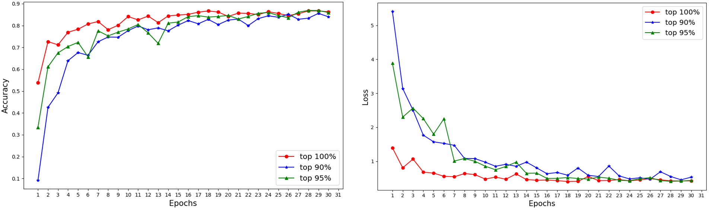

# 15.3：模型压缩

研究表明，大部分深度神经网络模型，在模型训练的过程中，都存在着权重参数冗余的问题，即在所有参数中，对模型性能起到重要作用的，往往只有很少的一部分（比如5%）权值。基于这个思想，在深度学习中，我们常常使用剪枝、量化、蒸漏等模型压缩手段来压缩模型，以达到模型性能与模型复杂度之间的平衡。

联邦学习在训练的过程中，影响其训练效率的一大因素就是服务端与客户端之间的模型参数交换。因此，我们可以利用模型压缩的思想，在传输的过程中，只传输部分的参数数据，一方面随着传输数据量的减少，能够有效降低网络传输的带宽消耗；另一方面，可以防止模型参数被窃取，由于只传输了部分参数数据，这样即使攻击者获取了这部分数据，由于没有全局信息，因此，也很难利用模型反演攻击来反推出原始数据，从而有效提升了系统的安全性。


## 15.3.1 代码使用

在本目录下，在命令行中执行下面的命令：

```
python main.py -c ./utils/conf.json
```

## 15.3.2 方法介绍

本小节我们考虑这样的一种压缩策略：模型在本地训练过程中，训练前后每一层的变化，选取前后变化大的层传输，为此，我们首先定义层敏感度的概念：

> 定义：设当前的模型表示为$G = \\{g_1, g_2, · · · , g_L\\}$，这里的$g_i$表示模型的第i层。设当前处在第$t$轮，客户端$C_j$进行联邦学习本地训练时，模型将从：
>
> $$G_t = \\{g^{t}\_{1,j} ,g^{t}\_{2,j}  , · · · , g^{t}\_{L,j} \\} $$
>
> 变为：
>
> $$L^{t+1}_j = \\{g^{t+1}\_{1,j} ,g^{t+1}\_{2,j}  , · · · , g^{t+1}\_{L,j} \\}$$
>
> 我们将第$i$层的变化记为：
>
> $$\delta^t_{i,j}=|mean(g^{t}\_{i,j}) - mean(g^{t+1}\_{i,j})|$$
>
> 我们将此每一层的参数均值变化量$\delta$，称为层敏感度。

基于按层敏感度的定义，对任意被挑选的客户端$C_j$，在模型本地训练结束后，按照上式计算模型的每一层均值变化量$\Delta^t_{i,j}=\\{\delta^t\_{1,j}, \delta^t\_{2,j}, ... , \delta^t\_{L,j} \\}$, 将每一层的敏感度变化量从大到小进行排序，变化越大，说明该层重要性越高。

## 15.3.3 配置文件

我们首先在配置文件中添加一个字段“rate”，用来控制传输比例，比如0.95表示传输最重要的前95%的层权重参数。
```python
{
	...,
	
	rate : 0.95
}
```

## 15.3.4 客户端训练
其本地训练代码如下所示，训练的过程与常规的本地迭代训练一致：

```python
for name, param in model.state_dict().items():
	self.local_model.state_dict()[name].copy_(param.clone())
optimizer = torch.optim.SGD(self.local_model.parameters(), lr=self.conf['lr'],
							momentum=self.conf['momentum'])

self.local_model.train()
for e in range(self.conf["local_epochs"]):
	for batch_id, batch in enumerate(self.train_loader):
		data, target = batch
		if torch.cuda.is_available():
			data = data.cuda()
			target = target.cuda()
	
		optimizer.zero_grad()
		output = self.local_model(data)
		loss = torch.nn.functional.cross_entropy(output, target)
		loss.backward()
		optimizer.step()
	print("Epoch %d done." % e)	
```
训练完毕后，求取每一层的变化值，并对变化值按大小从高到低进行排序，最后按照配置文件中设置的“rate”值，上传最重要的参数权重即可：
```python
diff = dict()
for name, data in self.local_model.state_dict().items():
	diff[name] = (data - model.state_dict()[name])	
diff = sorted(diff.items(), key=lambda item:abs(torch.mean(item[1].float())), reverse=True)
sum1, sum2 = 0, 0
for id, (name, data) in enumerate(diff):
	if id < 304:
		sum1 += torch.prod(torch.tensor(data.size()))
	else:
		sum2 += torch.prod(torch.tensor(data.size()))
	
ret_size = int(self.conf["rate"]*len(diff))

return dict(diff[:ret_size])
```

## 15.3.5 服务端

在服务端中进行聚合的时候，由于每一个客户端上传的只是部分的权重参数，需要根据不同的层来进行聚合，如下所示，在Pytorch中，我们可以通过权重的名字来实现这一过程：

```python
def model_aggregate(self, weight_accumulator, cnt):
	for name, data in self.global_model.state_dict().items():
		if name in weight_accumulator and cnt[name] > 0:
			update_per_layer = weight_accumulator[name] * (1.0 / cnt[name])
			
			if data.type() != update_per_layer.type():
				data.add_(update_per_layer.to(torch.int64))
			else:
				data.add_(update_per_layer)
```

## 15.3.6 效果分析

我们根据上传的参数比例不同，比较了在不同的比例配置下，模型性能之间的差别，从下图可以看到，选取重要的模型参数进行传输（top 90%），其性能与完整的参数传输（100%）相比，几乎没有下降。

<div align=center>

</div>