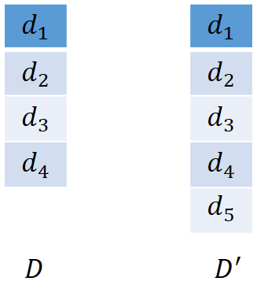
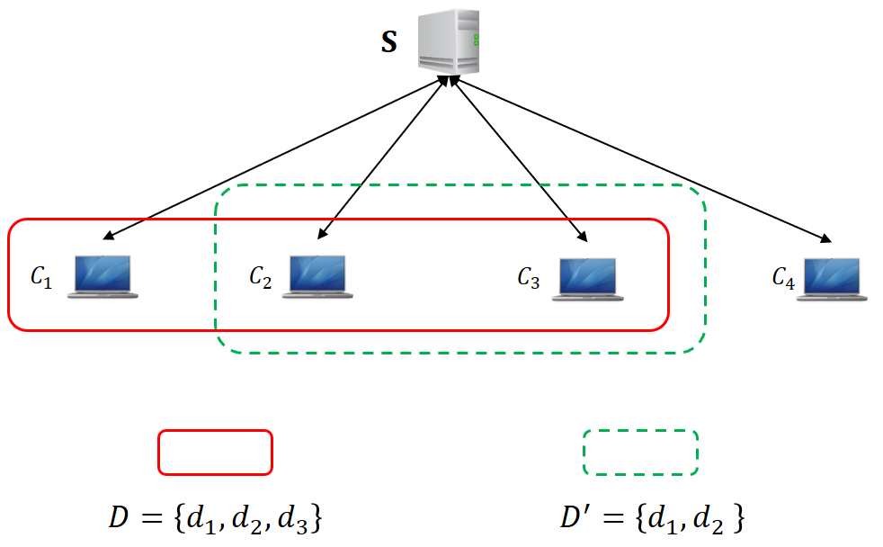
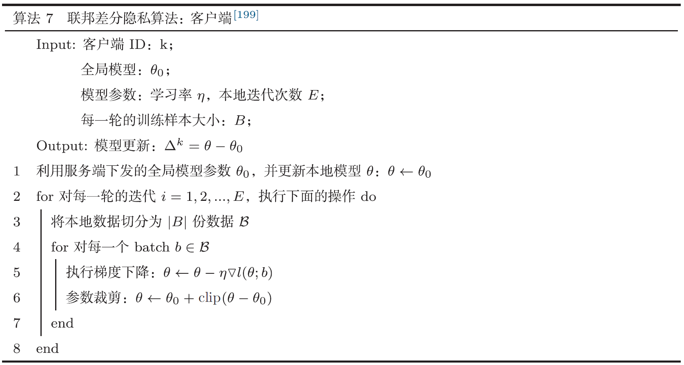
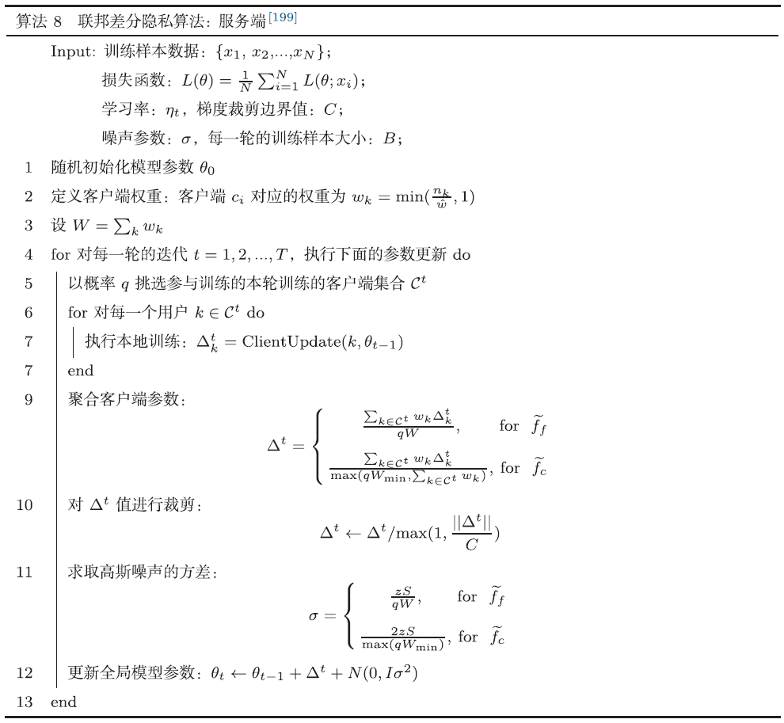

# 15.2：联邦差分隐私

与集中式差分隐私相比，在联邦学习场景下引入差分隐私技术，除了考虑到**数据层面**的隐私安全之外，还需要考虑到**用户层面**（称为user level或者client level）的安全问题。

我们首先来回顾集中式差分隐私，集中式差分隐私数据的定义是建在相邻数据集的概念基础上。

> 相邻数据集：设有两个数据集表示为$D$和$D^′$，若它们之间有且仅有一条数据不一样，那我们就称$D$和$D^′$为相邻数据集。如下图所示，数据集$D$和数据集$D^′$仅相差一个元素$d_5$。

<div align=center>

</div>


相邻数据集的定义为数据层面的隐私安全提供了一个参考标准。为了定义在用户层面的隐私安全，我们引入了用户相邻数据集（user-adjacent datasets）的概念，其定义如下：

> 用户相邻数据集：设每一个用户（即客户端）$C_i$对应的本地数据集为$d_i$，$D$和$D^′$是两个用户数据的集合，我们定义$D$和$D^′$为用户相邻数据集，当且仅当$D$去除或者添加某一个客户端$C_i$的本地数据集$d_i$后变为$D^{'}$。如下图所示：

<div align=center>

</div>
下面我们详细给出在联邦学习场景中实现差分隐私的方法。

## 15.2.1 代码使用

在本目录下，在命令行中执行下面的命令：

```
python main.py -c ./utils/conf.json
```

**注意：差分隐私在添加噪音数据后，前面几轮的迭代可能不稳定。读者可以自行设置conf.json中的超参数值：如梯度裁剪参数"c"，噪音参数"sigma"等。看看不同的超参数值对结果的影响。**


## 15.2.2 DP-FedAvg算法

DP-FedAvg的算法，是指将联邦学习中经典的Federated Average算法和差分隐私技术相结合，最早由文献 [<sup>1</sup>](#refer-anchor-1) 提出，具体来说，它主要包括本地客户端参数裁剪和服务端聚合添加噪音。

## 15.2.3 客户端

客户端的本地训练流程如下所示：

<div align=center>

</div>

具体来说，相比于常规的本地训练，其主要修改点是在每一轮的梯度下降结束后，对参数进行裁剪：

$$clip(\theta - \theta_0) = \frac{C}{||\theta - \theta_0||}$$

```python
def local_train(self, model):
	for name, param in model.state_dict().items():
		self.local_model.state_dict()[name].copy_(param.clone())

	optimizer = torch.optim.SGD(self.local_model.parameters(), lr=self.conf['lr'],
								momentum=self.conf['momentum'])
	self.local_model.train()
	for e in range(self.conf["local_epochs"]):
		
		for batch_id, batch in enumerate(self.train_loader):
			data, target = batch
			if torch.cuda.is_available():
				data = data.cuda()
				target = target.cuda()
		
			optimizer.zero_grad()
			output = self.local_model(data)
			loss = torch.nn.functional.cross_entropy(output, target)
			loss.backward()
			optimizer.step()
			if self.conf["dp"]:
				model_norm = models.model_norm(model, self.local_model)
				norm_scale = min(1, self.conf['C'] / (model_norm))
				for name, layer in self.local_model.named_parameters():
					clipped_difference = norm_scale * (layer.data - model.state_dict()[name])
					layer.data.copy_(model.state_dict()[name] + clipped_difference)
					
		print("Epoch %d done." % e)	
	diff = dict()
	for name, data in self.local_model.state_dict().items():
		diff[name] = (data - model.state_dict()[name])

	return diff
```

## 15.2.4 服务端

服务端侧的流程如下所示：

<div align=center>

</div>

服务端侧的主要修改在于对全局模型参数进行聚合时添加噪声。噪声数据由高斯分布生成。

```python
def model_aggregate(self, weight_accumulator):
	for name, data in self.global_model.state_dict().items():
		
		update_per_layer = weight_accumulator[name] * self.conf["lambda"]
		
		if self.conf['dp']:
			sigma = self.conf['sigma']
			if torch.cuda.is_available():
				noise = torch.cuda.FloatTensor(update_per_layer.shape).normal_(0, sigma)
			else:
				noise = torch.FloatTensor(update_per_layer.shape).normal_(0, sigma)	
			update_per_layer.add_(noise)
		if data.type() != update_per_layer.type():
			data.add_(update_per_layer.to(torch.int64))
		else:
			data.add_(update_per_layer)
```


## 参考文献

<div id="refer-anchor-1"></div>
\- [1] [Learning differentially private recurrent language models](https://arxiv.org/abs/1710.06963)