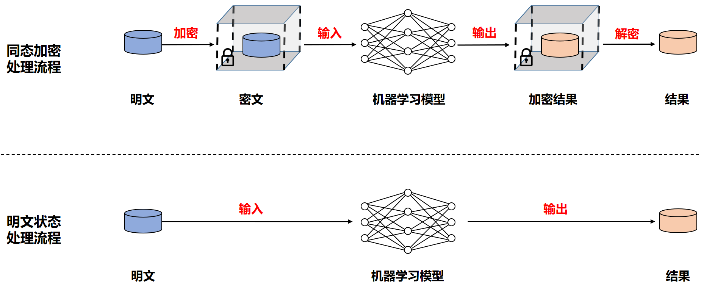
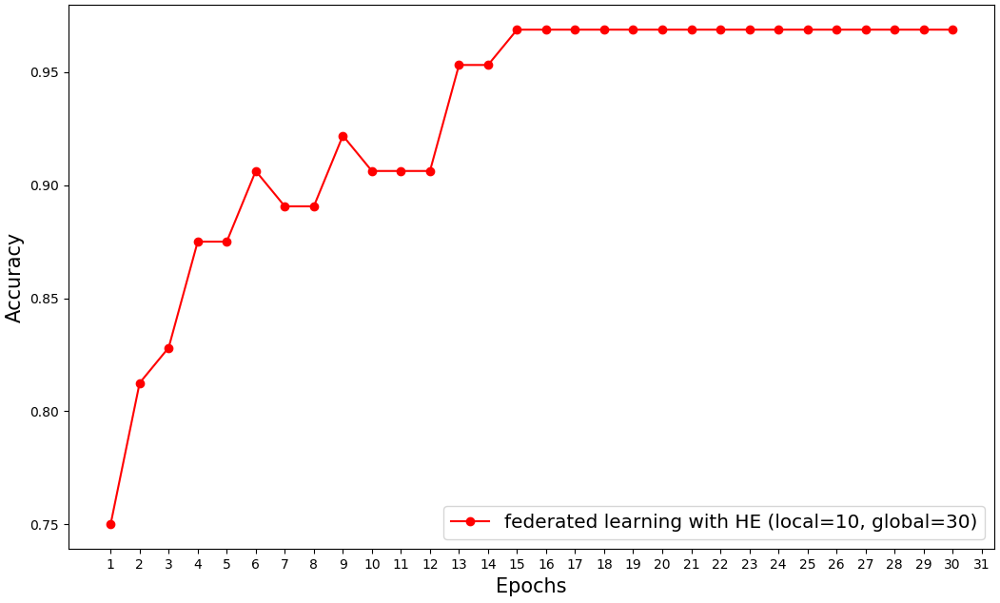

# 15.4：同态加密

同态加密（HE）的概念最初由Rivest等人在1978年提出。同态加密提供了一种对加密数据进行处理的功能， 是一种允许对密文进行计算操作，并生成加密结果的加密技术。在 密文上获得的计算结果被解密后与在明文上的计算结果相匹配，就如同对明文执行了一样的计算操作，如下图所示：

<div align=center>

</div>


在第二章，我们介绍同态加密又可以分为全同态加密、些许同态加密和半同态加密三种形式。这其中，由于受到性能等因素的约束，当前在工业界主要使用半同态加密算法。

本节我们将讨论在联邦学习下，以半同态加密作为安全机制，实现在加密状态下的Logistic Regression训练，[Paillier半同态加密算法](paillier.py)是由Pascal Paillier在1999 年提出，它是一种加法半同态加密。假设我们使用$u$来表示明文，$[[u]]$来表示密文，那么Paillier 半同态加密算法满足：

$$[[u+v]] = [[u]] + [[v]]$$

&nbsp; 

## 15.4.1 加密损失函数

假设当前有$n$个样本数据集，设为：

$$T=[(x_1, y_1), (x_2, y_2), ..., (x_n, y_n)] \tag{1}$$

LR的对数损失函数，在明文状态下可以写为：

$$L=\frac{1}{n}\sum_{i=1}^{n}{\log(1+e^{-y_i{\theta}^T{x_i}})} \tag{2}$$

对上式进行求导，求得损失函数值$L$关于模型参数$\theta$的梯度$\frac{\partial{L}}{\partial{\theta}}$，满足：

$$\frac{\partial{L}}{\partial{\theta}}=\frac{1}{n}\sum_{i=1}^{n}{(\frac{1}{1+e^{-y_i{\theta}^T{x_i}}}-1)y_ix_i} \tag{3}$$

利用梯度下降，我们可以求出每一步的参数更新：

$$\theta = \theta - lr*\frac{\partial{L}}{\partial{\theta}} \tag{4}$$

上面的计算过程，包括参数$\theta$和数据$(x, y)$都是在明文状态下计算，在联邦学习场景，这种做法会存在数据泄密的风险，而基于HE 的联邦学习，则要求在加密的状态下进行参数求解，也就是通常来说，传输的参数$\theta$是一个加密后的值$[[\theta]]$，我们将损失函数可以改写为：

$$L=\frac{1}{n}\sum_{i=1}^{n}{\log(1+e^{-y_i{[[\theta]]}^T{x_i}})}  \tag{5}$$

上式涉及到对加密数据的指数运算和对数运算，但前面我们已经讲解Paillier加密算法只支持加法同态和标量乘法同态，不支持乘法同态，更不支持复杂的指数和对数运算，因此无法在加密的状态下求解。文献[1]提出一种Taylor 损失来近似原始对数损失的方法，即通过对原始的对数损失函数进行泰勒展开，通过多项式来近似对数损失函数，经过泰勒展开后，损失函数转化为只有标量乘法和加法的运算，从而可以直接应用Paillier 来进行加密求解。

我们来回顾对于任意的函数$f(z)$，其在$z=0$处的泰勒多项式展开可以表示为：

$$f(z)=\sum_{i=0}^{\infty} {\frac{f^{'}(0)}{i!}z^i} \tag{6}$$

当$f(z)$为对数损失函数，即$f(z)=\log(1 + e^{-z})$在$z = 0$处的泰勒展开表达式：

$$\log(1 + e^{-z}) \approx \log{2} - \frac{1}{2}z + \frac{1}{8}z^2+O(z^2)  \tag{7}$$

这里我们使用其中的二阶多项式来近似对数损失函数，并将$z = y{\theta}^T x$ 代入上式，得到:

$$\log(1 + e^{-{ y{\theta}^T x}}) \approx \log{2} - \frac{1}{2}{ y{\theta}^T x} + \frac{1}{8}{ ({\theta}^T x)}^2  \tag{8}$$

这其中最后一项，由于$y^2 = 1$，因此我们直接去掉$y$，将$(8)$式代入$(2)$式得：

$$L=\frac{1}{n}\sum_{i=1}^{n}{[\log{2} - \frac{1}{2}{ {y_i}{\theta}^T {x_i}} + \frac{1}{8}{ ({\theta}^T {x_i})}^2  ]}   \tag{9}$$

对$(9)$式求导，得到损失值$L$关于参数$\theta$的梯度值为：

$$\frac{\partial{L}}{\partial{\theta}}=\frac{1}{n}\sum_{i=1}^{n}{(\frac{1}{4}{\theta}^T{x_i}-\frac{1}{2}{y_i})x_i} \tag{10}$$

对应得到式$(10)$的加密梯度为：

$$[[\frac{\partial{L}}{\partial{\theta}}]]=\frac{1}{n}\sum_{i=1}^{n}{(\frac{1}{4}{[[\theta]]}^T{x_i}-\frac{1}{2}{y_i})x_i} \tag{11}$$

&nbsp; 

## 15.4.2 代码使用

在本目录下，在命令行中执行下面的命令：

```
python main.py -c ./utils/conf.json
```

## 15.4.3 详细实现

**定义模型类：** 本节将LR 作为联邦训练模型，但由于涉及数据加密和解密等操作，我们首先自定义一个模型类LR_Model，以方便我们进行加解密

```python
class LR_Model(object):
	def __init__ (self, public_key, w_size=None, w=None, encrypted=False):
		"""
		w_size: 权重参数数量
		w: 是否直接传递已有权重，w和w_size只需要传递一个即可
		encrypted: 是明文还是加密的形式
		"""
		self.public_key = public_key
		if w is not None:
			self.weights = w
		else:
			limit = -1.0/w_size 
			self.weights = np.random.uniform(-0.5, 0.5, (w_size,))
		
		if encrypted==False:
			self.encrypt_weights = encrypt_vector(public_key, self.weights)
		else:
			self.encrypt_weights = self.weights	
			
	def set_encrypt_weights(self, w):
		for id, e in enumerate(w):
			self.encrypt_weights[id] = e 
		
	def set_raw_weights(self, w):
		for id, e in enumerate(w):
			self.weights[id] = e 
			
```

**本地模型训练：** 在本地的模型训练中，模型参数是在加密的状态下进行，其过程如下所示：

```python
	def local_train(self, weights):	
		original_w = weights
		self.local_model.set_encrypt_weights(weights)
		neg_one = self.public_key.encrypt(-1)
		
		for e in range(self.conf["local_epochs"]):
			print("start epoch ", e)
			idx = np.arange(self.data_x.shape[0])
			batch_idx = np.random.choice(idx, self.conf['batch_size'], replace=False)
			#print(batch_idx)
			
			x = self.data_x[batch_idx]
			x = np.concatenate((x, np.ones((x.shape[0], 1))), axis=1)
			y = self.data_y[batch_idx].reshape((-1, 1))

			batch_encrypted_grad = x.transpose() * (0.25 * x.dot(self.local_model.encrypt_weights) + 0.5 * y.transpose() * neg_one)
			encrypted_grad = batch_encrypted_grad.sum(axis=1) / y.shape[0]
			
			for j in range(len(self.local_model.encrypt_weights)):
				self.local_model.encrypt_weights[j] -= self.conf["lr"] * encrypted_grad[j]

		weight_accumulators = []
		#print(models.decrypt_vector(Server.private_key, weights))
		for j in range(len(self.local_model.encrypt_weights)):
			weight_accumulators.append(self.local_model.encrypt_weights[j] - original_w[j])
		
		return weight_accumulators
```

算法开始时，先复制服务端下发的全局模型权重，并将本地模型的权重更新为全局模型权重：

```python
original_w = weights
self.local_model.set_encrypt_weights(weights)
```

在本地训练的每一轮迭代中，都随机挑选batch_size 大小的训练数据进行训练：

```python
idx = np.arange(self.data_x.shape[0])
batch_idx = np.random.choice(idx, self.conf['batch_size'], replace=False)
x = self.data_x[batch_idx]
x = np.concatenate((x, np.ones((x.shape[0], 1))), axis=1)
y = self.data_y[batch_idx].reshape((-1, 1))
```

接下来，在加密状态下求取加密梯度。利用式(11) 的梯度公式来求解，并利用梯度下降来更新模型参数：

```python
batch_encrypted_grad = x.transpose() * (0.25 * x.dot(self.local_model.encrypt_weights) + 0.5 * y.transpose() * neg_one)
encrypted_grad = batch_encrypted_grad.sum(axis=1) / y.shape[0]
			
for j in range(len(self.local_model.encrypt_weights)):
	self.local_model.encrypt_weights[j] -= self.conf["lr"] * encrypted_grad[j]
```


## 15.4.4 实验结果比较

我们使用乳腺癌数据集作为我们本节的训练数据（在data目录下），在同态加密下进行联邦学习训练后的模型准确率如下所示：

<div align=center>

</div>

&nbsp; 

## 15.4.5 参考文献

- [Private federated
  learning on vertically partitioned data via entity resolution and additively
  homomorphic encryption](https://arxiv.org/pdf/1711.10677.pdf)