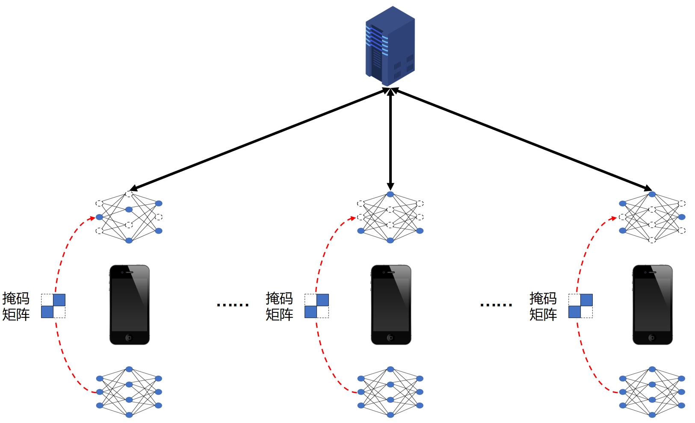
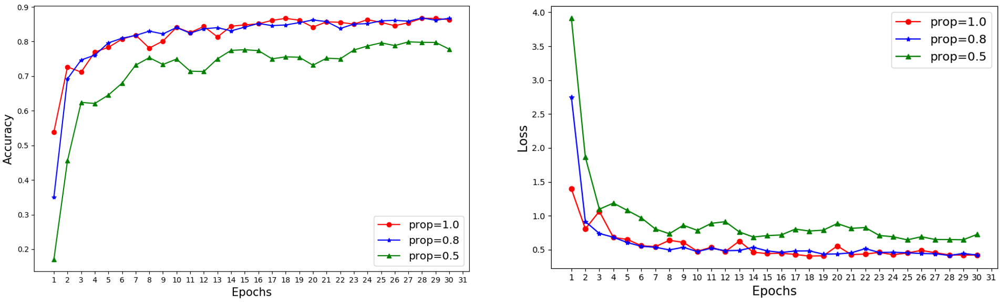

# 15.5：参数稀疏化

稀疏化策略本质上模型压缩的一种，同样是通过传输少量的参数，一方面减少服务端与客户端之间的网络带宽；另一方面也能够防止全局模型参数泄露。

## 15.5.1 方案简介

假设当前处在第$t$轮迭代，设当前客户端$C_i$进行本地迭代训练的模型结构为$G_t=[g_1, g_2, ..., g_L]$，这里的$g_i$表示$G_t$的第$i$层的，客户端$C_i$进行本地迭代训练，模型将从$G_t$变为$L^{t+1}_i$，在传统的联邦学习中，客户端$C_i$将向服务端上传模型参数$(L\_{t+1}-G_t)$。

稀疏化是指，在本地联邦训练的过程中，每一个客户端中保存一份掩码矩阵$R=[r_1, r_2, ..., r_L]$，$r_i$是与$g_i$形状大小相同的参数矩阵，且只由0和1构成。当客户端本地训练结束之后，将向服务端上传模型参数$(L\_{t+1}-G_t)$与掩码矩阵进行相乘，只有不为0的参数值才会上传。如下图所示：

<div align=center>

</div>


## 15.5.2 配置
为此，我们首先在配置文件中添加新字段“prop”，它是用来控制掩码矩阵中1的数量，具体来说，”prop” 越大，即掩码矩阵中1 的值越多，矩阵越稠密；相反，”prop” 越小，即掩码矩阵中1 的值越少，矩阵越稀疏。

```python
{
    ...,
    prop : 0.8
}
```

## 15.5.3 客户端

客户端首先生成构造函数中，创建一个掩码矩阵，掩码矩阵是一个0-1矩阵，我们使用bernoulli分布来随机生成：

```python
class Client(object):
	def __init__(self, conf, model, train_dataset, id = -1):
        ...
        
		self.mask = {}
		for name, param in self.local_model.state_dict().items():
			p=torch.ones_like(param)*self.conf["prop"]
			if torch.is_floating_point(param):
				self.mask[name] = torch.bernoulli(p)
			else:
				self.mask[name] = torch.bernoulli(p).long()
```

客户端本地训练过程与传统训练过程基本一致，但在模型参数上传的时候，会利用掩码矩阵，只返回掩码矩阵中对应1的权重值。

```python
def local_train(self, model):
	for name, param in model.state_dict().items():
		self.local_model.state_dict()[name].copy_(param.clone())

	optimizer = torch.optim.SGD(self.local_model.parameters(), lr=self.conf['lr'],
								momentum=self.conf['momentum'])	
	self.local_model.train()
	for e in range(self.conf["local_epochs"]):	
		for batch_id, batch in enumerate(self.train_loader):
			data, target = batch

			if torch.cuda.is_available():
				data = data.cuda()
				target = target.cuda()
		
			optimizer.zero_grad()
			output = self.local_model(data)
			loss = torch.nn.functional.cross_entropy(output, target)
			loss.backward()
			optimizer.step()			
		print("Epoch %d done." % e)	
		
	diff = dict()
	for name, data in self.local_model.state_dict().items():
		diff[name] = (data - model.state_dict()[name])
		#print(diff[name].size(), self.mask[name].size())
		diff[name] = diff[name]*self.mask[name]

	return diff
```


## 15.5.4 代码使用

在本目录下，在命令行中执行下面的命令：

```
python main.py -c ./utils/conf.json
```


## 15.5.5 效果对比

我们来看经过参数稀疏化之后，模型的性能表现如下图所示，可以看到，随着掩码矩阵中0的数量越来越多，稀疏化的模型性能在开始迭代时会有所下降，但随着迭代的进行，模型的性能会逐步恢复到正常状态。

<div align=center>

</div>