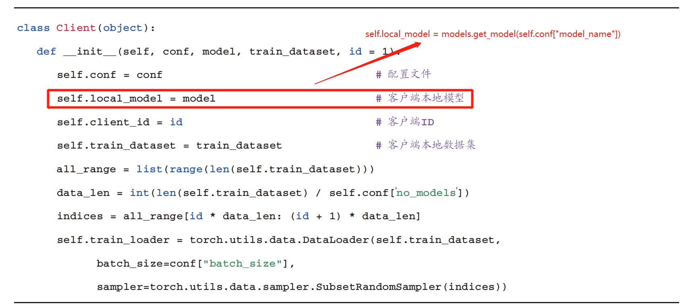
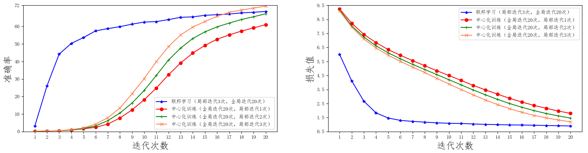
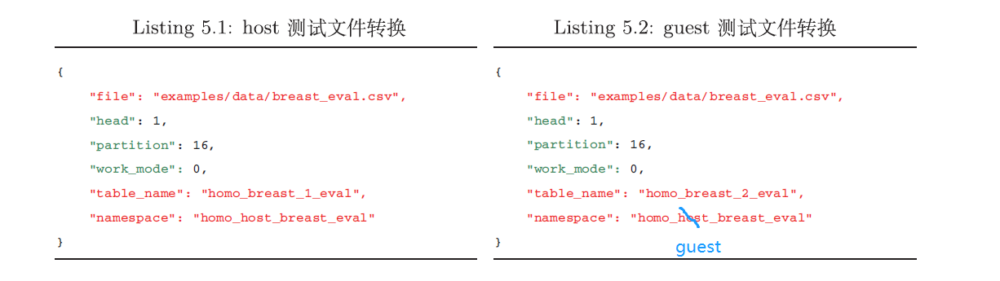

# 《联邦学习实战》勘误

## 第三章

- 3-1：第45页，客户端的构造函数中，客户端模型的初始化问题，应该重新赋值，而不是由全局模型赋值，防止共用内存空间。

- 3-2：第48页，图3.5修改，同时增加了迭代不同次数的比较。

  

## 第五章

- 5-1：第64页，Listing 5.2中，namespace（命名空间）印刷错误：”homo_host_breast_eval“ 改为 ”homo_guest_breast_eval “

